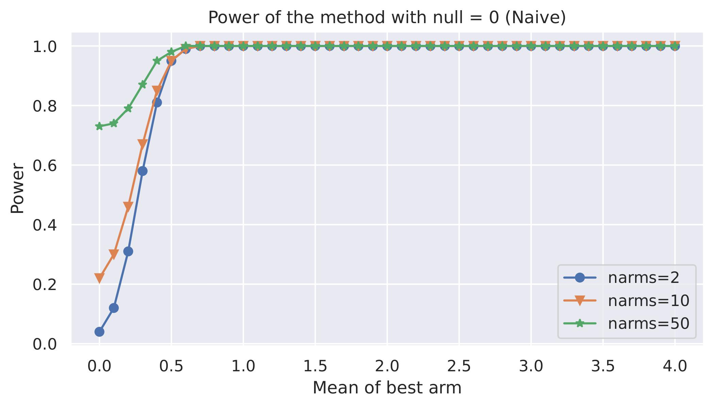

# Randomization

     &nbsp;

## Coverage Probability
The coverage probability of the methods with `ntrials=1000`, `narms=2, 10, 50` and `50` samples per arm. The difference between the winning arm and the remaining arms ranging from `0` to `8`. The mean and covariance being `mu, cov = np.array([mu_max] + [0] * (narms-1)), np.ones(narms)`.

### Naive method

### Winners method

## Power
The power of the methods with `ntrials=1000`, `narms=2, 10, 50` and `50` samples per arm. The difference between the winning arm and the remaining arms ranging from `0` to `4`. The mean and covariance being `mu, cov = np.array([mu_max] + [0] * (narms-1)), np.ones(narms)` with `null=0`. 

### Naive method

### Winners method

### RD method
For the RD method `ntests = 5` and `ntrans = 500`.

### Comparison
<a href="./__results__/simulation" target="_blank">Comparision</a> of power between different methods with `ntrials=1000`, `narms=5`, `nsamples=5000`, `mu = (np.arange(narms) - 3) / 10`, `cov = np.ones(narms)`. For the RD method `ntests_li = [1, 2, 3, 4, 5, 10, 20]` and `ntrans = 500`.

|             | ntests=1, ntrans=500 | ntests=2, ntrans=500 | ntests=3, ntrans=500 | ntests=4, ntrans=500 | ntests=5, ntrans=500 | ntests=10, ntrans=500 | ntests=20, ntrans=500  | ntests=30, ntrans=500 | ntests=50, ntrans=500 |
|-------------|:--------------------:|:--------------------:|:--------------------:|:--------------------:|:--------------------:|:---------------------:|:----------------------:|:---------------------:|:---------------------:|
| **Naive**   |        0.897         |        0.876         |        0.885         |        0.884         |        0.906         |         0.899         |         0.900          |         0.898         |         0.870         |
| **Winners** |        0.792         |        0.759         |        0.789         |        0.772         |        0.813         |         0.800         |         0.786          |         0.808         |         0.777         |
| **RD**      |        0.466         |        0.548         |        0.603         |        0.581         |        0.608         |         0.656         |         0.655          |         0.661         |         0.663         |

## Caveats
- **Winners:** Fast computation when `mu` is known and the quantity to compute is `alpha`. Slow computation when `alpha` is known and the quantity to compute is `mu`.
